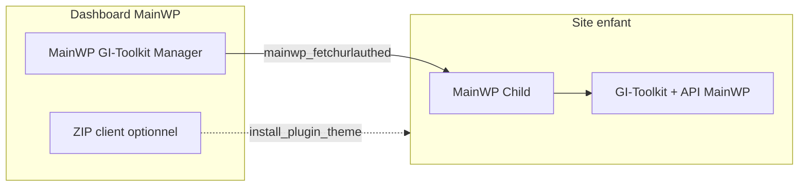

# GIWP — Monorepo Genevois Informatique

Dépôt regroupant **GI-Toolkit** (plugin sur chaque site WordPress) et **MainWP GI-Toolkit Manager** (extension sur le dashboard MainWP central). Ensemble, ils permettent de piloter la configuration et les modules GI-Toolkit sur tout un parc de sites.

| Composant | Dossier | Version | Où l’installer |
|-----------|---------|---------|----------------|
| **GI-Toolkit** | `wordpress_giwp/` | 2.20.21 | Chaque site WordPress (enfant MainWP) |
| **MainWP GI-Toolkit Manager** | `mainwp_giwp/` | 1.4.2 | Dashboard MainWP uniquement |

---

## Vue d’ensemble



- **GI-Toolkit** : suite modulaire d’outils d’administration WordPress (sécurité, contenu, e-mail, WooCommerce, etc.).
- **MainWP GI-Toolkit Manager** : interface centralisée pour synchroniser l’état des sites, importer/déployer des configurations, gérer des modèles et suivre les e-mails capturés (Mail Catcher).

---

## Prérequis

### Sur chaque site enfant

1. [MainWP Child](https://mainwp.com/) actif et connecté au dashboard  
2. **GI-Toolkit** ≥ 2.20.1 actif (API MainWP incluse)

### Sur le dashboard MainWP

1. [MainWP Dashboard](https://mainwp.com/) actif  
2. Extension **MainWP GI-Toolkit Manager** activée dans WordPress **et** dans **MainWP → Extensions**

---

## Installation

Copiez chaque dossier dans `wp-content/plugins/` :

```
wp-content/plugins/gi-toolkit/     ← contenu de wordpress_giwp/
wp-content/plugins/mainwp-giwp/    ← contenu de mainwp_giwp/
```

En développement depuis ce monorepo, le catalogue de modules du dashboard lit automatiquement `wordpress_giwp/` via le chemin relatif `../wordpress_giwp/` (génération du ZIP client pour l’onboarding).

---

## Extension 1 — GI-Toolkit (`wordpress_giwp/`)

Plugin WordPress qui regroupe **123 modules** répartis en catégories. Chaque module peut être activé ou désactivé depuis **Réglages → GI-Toolkit**.

Fonctionnalités notables côté site :

- Configuration exportable / importable (bundle modules + options)
- **Mail Catcher** : journal des e-mails WordPress, aperçu HTML/RAW/JSON, renvoi, actions groupées
- **SMTP Mailer**, snippets, sécurité, maintenance, etc.
- API distante pour MainWP (`Gi_Toolkit_MainWP_API`) : statut, export, import, options par module

Documentation détaillée : `wordpress_giwp/readme.txt`, changelog : `wordpress_giwp/changelog.txt`.

---

## Extension 2 — MainWP GI-Toolkit Manager (`mainwp_giwp/`)

Accessible via **MainWP → Extensions → GI-Toolkit Manager** (interface MainWP, onglets sans rechargement complet).

| Onglet | Rôle |
|--------|------|
| **Vue d’ensemble** | Liste des sites, statut GI-Toolkit, version, modules actifs, stats mail ; bouton **Synchroniser les statuts** |
| **Modules** | Configuration de travail : activer/désactiver des modules avant déploiement |
| **Modèles** | Snapshots nommés de configuration (profils) |
| **Déploiement** | Push de la config ou d’un modèle vers plusieurs sites (progression AJAX) |
| **Exclusions** | Modules ou options à ne pas écraser par site |
| **Historique** | Journal des déploiements (succès / échec par site) |
| **Réglages** | Profil par défaut, onboarding, alertes mail, **URL ZIP client**, **parallélisme de sync** |

### Widget dashboard MainWP

Widget optionnel : volume mail sur 7 jours, répartition par site (liens), taux de succès. Peut être masqué dans les réglages MainWP.

### Onboarding « Ajouter un site »

Sur le formulaire MainWP d’ajout de site :

- Installation automatique de GI-Toolkit depuis le ZIP (auto-généré ou URL personnalisée)
- Application optionnelle d’un profil (modèle « Default » ou réglage)

---

## Synchronisation MainWP

### Chaîne technique

```
Dashboard
  → mainwp_fetchurlauthed( …, 'extra_execution', { action: gi_toolkit, … } )
  → MainWP Child
  → filtre mainwp_child_extra_execution
  → Gi_Toolkit_MainWP_API::handle_request()
```

### Actions API (côté enfant)

| Action | Description |
|--------|-------------|
| `status` | Version GI-Toolkit, compatibilité API, modules actifs, stats **Mail Catcher** |
| `export` | Export du bundle de configuration (modules + options) |
| `import` | Import d’un bundle (avec exclusions éventuelles) |
| `set_modules` | Activation / désactivation de modules |
| `get_module_options` / `set_module_options` | Lecture / écriture des réglages d’un module |

Version minimale API côté enfant : **2.19.0** (vérifiée via `api_compatible` dans le statut).

### Modes de synchronisation des statuts

1. **Manuelle** — Onglet *Vue d’ensemble* → **Synchroniser les statuts**  
   - Interrogation parallèle des sites (réglable : 1 à 15, défaut **5**)  
   - Cache persistant (`MainWP_GIWeb_Status_Cache`) : les données restent visibles après rechargement  
   - Mise à jour des agrégats mail réseau

2. **Automatique** — Hook `mainwp_site_synced` : lors d’une sync globale MainWP, chaque site remonte aussi son statut GI-Toolkit et ses stats mail.

### Données remontées par site (vue d’ensemble)

- Présence et version de GI-Toolkit  
- Nombre de modules actifs  
- Erreur de connexion / API si échec  
- **Mail Catcher** : totaux, échecs, volume du jour (pour alertes et widget)

### Alertes e-mail

Réglages : seuil d’échecs par site, e-mail de notification. Déclenchées après une synchronisation si des sites ont des mails en échec.

### Déploiement

- Sélection de sites + modèle ou configuration de travail  
- Déploiement site par site en AJAX avec modale de progression  
- Respect des **exclusions** par site (modules / options)  
- Historique consultable dans l’onglet dédié

---

## Catalogue des modules GI-Toolkit (123)

Liste issue du catalogue officiel (`Gi_Toolkit_Modules_Data`).

#### Administration

- Admin Menu Organizer
- Clean Up Admin Bar
- Custom Login Design
- Disable Dashboard Widgets
- Enhance List Tables
- Heartbeat Control
- Hide Admin Bar
- Hide Admin Notices
- Hide Plugins
- Log In/Out Menu
- Maintenance Mode
- Password Protection
- Plugin & Theme Rollback
- Redirect After Login
- Redirect After Logout
- Wider Admin Menu

#### Utilisateurs

- Clean Profiles
- Export Users
- Last Login Column
- Local avatars
- Multiple User Roles
- Temporary Login
- User Switching

#### Contenus & médias

- Add Essentials Shortcodes
- Allow Menu Custom Links to Open in New Tab
- Auto-Publish Posts with Missed Schedule
- Browser Theme Color
- Content Duplication
- Content Order
- Download medias as zip
- Duplicate Menu
- Export Posts & Pages
- External Permalinks
- Generate Alt Text With AI
- Image Upload Control
- Media Cleaner
- Media Encoder
- Media Replacement
- Nav Menu Visibility
- Obfuscate Email Addresses
- Open All External Links in New Tab
- Paste Image In Media
- Post Per Page
- Post Type Switcher
- Quick Add Post
- Redirect 404 to Homepage
- Register Custom Content Types
- Revisions Control
- Search Replace in database
- SVG Upload

#### Code personnalisé

- Code Snippets
- Custom Admin CSS
- Custom Body Class
- Custom Frontend CSS
- Insert head, body and footer Code
- Manage ads.txt and app-ads.txt
- Manage robots.txt

#### Désactivation de fonctionnalités

- Disable Block-Based Widgets Settings Screen
- Disable Comments
- Disable dashicons CSS and JS files
- Disable emoji support
- Disable Feeds
- Disable Gutenberg
- Disable jQuery Migrate
- Disable Really Simple Discovery (RSD) link tag
- Disable REST API
- Disable Windows Live Writer (WLW) manifest link tag
- Disable WordPress shortlink link tag

#### SEO & performances

- 410 Manager
- Disable WP Sitemap
- Head Sorter
- Link Shortener

#### WooCommerce

- Auto clean actionscheduler_actions
- Disable cart fragments scripts
- Disable Woocommerce Logout Confirmation
- My Account Menu Customizer

#### Sécurité

- Auto Regenerate Salt Keys
- Ban Emails
- Better Password Hash
- Blacklisted Usernames
- Block User Registration from Disposable Email
- Disable XML-RPC
- Disallow Access WP Sensible Files
- Disallow Bad Requests
- Disallow Countries IP
- Disallow Dir Listing
- Disallow Malicious File Access in upload
- Disallow Plugin Upload
- Disallow register user
- Disallow Theme Upload
- Disallow WP File Edit
- Force SSL
- Force Strong Password
- Hide Login Errors
- Hide PHP Versions
- Hide WordPress Version
- Limit Login Attempts
- Lock Admin Email
- Lock Site URL
- Manage Admin Emails Notifications
- Move Login URL
- No Plugin Activation / Deactivation / Deletion
- Obfuscate Author Slugs
- Prevent User Enumeration
- Protect Website Headers
- Two Factor Authentication
- Vulnerabilities Scan

#### Débogage

- Adminer
- Advanced Debug Mode
- CRON Manager
- Disable All Updates
- Disable Plugin For Debug
- Disable wp_mail
- File Manager
- Force Send All Email To
- Hook And Filter Debugger
- Mail catcher
- Meta Debugger
- Updates Logs

#### Autres

- Apple Touch Icon
- Change Database Prefix
- Child theme generator
- Plugin Download
- SMTP Mailer

> **Modules à risque élevé** (déploiement MainWP) : Code Snippets, File Manager, Adminer, Search Replace in database — à manipuler avec précaution.

---

## Développement

| Fichier / zone | Rôle |
|----------------|------|
| `wordpress_giwp/admin/class-modules-data.php` | Source du catalogue modules |
| `wordpress_giwp/includes/class-gi-toolkit-mainwp-api.php` | API enfant MainWP |
| `mainwp_giwp/includes/class-mainwp-giweb-*.php` | Logique dashboard |
| `mainwp_giwp/assets/js/admin.js` | Sync parallèle, onglets, déploiement AJAX |

Structure recommandée en local : cloner le monorepo et lier ou copier les deux dossiers dans `wp-content/plugins/` du dashboard et des enfants de test.

---

## Documentation complémentaire

- [MainWP](https://mainwp.com/) — Child + Dashboard  
- Changelog GI-Toolkit : `wordpress_giwp/changelog.txt`  
- Extension MainWP : `mainwp_giwp/readme.txt`  
- Fiche WordPress.org : `wordpress_giwp/readme.txt`

---

*Genevois Informatique — [genevois-informatique.com](https://genevois-informatique.com/)*
